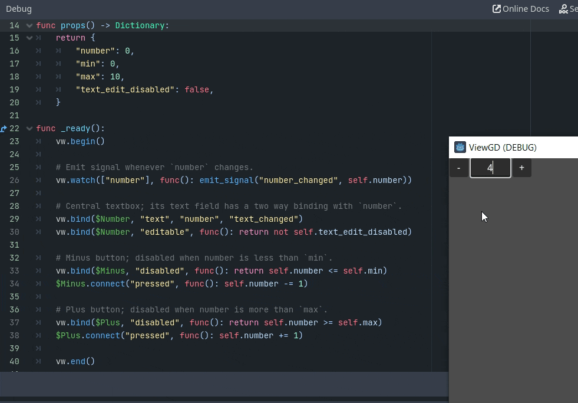

**Disclaimer: The code here will not work with the current version of Godot (4.4.1) due to the way setters and getters now work, and I am not actively maintaining this repo. There are more up to date projects such as [Rdot](https://github.com/Nitwel/Rdot) you should look at instead if you want to actually use this in a game. That being said, if you're just interested in how I implemented reactivity here, feel free to continue browsing.**

# ViewGD



ViewGD is a single-file library for Godot that lets you create reactive UI components declaratively. It's based on [Vue.js](https://vuejs.org/), so if you've used it before, you should feel right at home!

The philosophy of this library is to augment Godot's UI capabilities, not replace it. Thanks to the engine's hierarchical node system, signals, lambdas, and `$nodepath` syntax, all the pieces are already there. The only pain point is managing internal component state, which is where this comes in. If you haven't used a reactive UI framework before, [this is a good primer](https://vuejs.org/guide/extras/reactivity-in-depth.html)!

## Installation
All you need to do to use this library is either clone or download this repo, then copy `view_gd.gd` into your project. Doesn't matter which folder you put it in, it'll still work. Optionally, you can copy the [script_templates](https://docs.godotengine.org/en/stable/tutorials/scripting/creating_script_templates.html) folder to cut down on boilerplate. Whenever you want to create a new UI component, create a new `Control` node and select the `UI` template!

## Tutorial
At its core, ViewGD is just a reactive state manager. You declare some data, bind it to node properties, and those properties will update automatically whenever the data changes. Create a Button node, and add a new script to it, using the default Godot template. Add this boilerplate at the top of the script:

```GDScript
var vw := ViewGD.new(self)
func _set(property, value):
    return vw.set(property, value)
func _get(property):
    return return vw.get(property)
```
On the first line, we create a new ViewGD instance and pass our current node to it. This lets it call methods in this script. We also bind it to the node's getters and setters, which makes for better ergonomics and allows the node to expose state externally.

Next, let's enter the `_ready()` method. Set it up like this:

```GDScript
func _ready():
    vw.begin()

    vw.data({
        "number": 0,
    })
    vw.computed("label", func(): return "Pressed " + str(get("number")) + " times")
    vw.bind(self, "text", "label")

    vw.end()
```

We can see a couple things happening here:

 1. We've used `data()` to declare some internal state: a variable called `number` with the value 0.
 2. `computed()` declares a computed property named `label`, which means it's a property that should be modified whenever its reactive dependencies change. As seen in the definition, it returns a string that formats `number`.
 3. Finally, `bind()` binds the computed value `label` to the button's text field.
 
 If you run the scene now, the button should now display "Pressed 0 times".

You might be wondering, why are we putting our code between `vw.begin()` and `vw.end()`? The answer is, calls to ViewGD made between these two calls will invoke its reactivity recording system. Without them, ViewGD wouldn't be able to see that `number` is a dependency of `label`, and that `label` should be updated whenever `number` changes.

Speaking of changes, let's add some interactivity now. Add this to your script:

```GDScript
func _ready():
    vw.begin()

    # ...Code from before omitted...

    self.connect("pressed", func(): self.number += 1)

    vw.end()
```

If you've been using GDScript for a while, there should be no surprise here. All we're doing is connecting the button's `pressed` signal and incrementing the `number` value whenever it's emitted.

What *is* surprising is when you run this scene now and click the button, the label changes to "Pressed **1** times", even though we didn't edit `label` or the button's `text` property!

That's the power of reactivity, and it can greatly simplify state management in more complex components.

Just to close things off, we'll use the final major tool ViewGD gives us:

```GDScript
func _ready():
    vw.begin()

    # ...Code from before omitted...

    vw.watch(["number"], func(): print("The number has been updated to " + str(self.number) + "!"))

    vw.end()
```
Clicking the button now should print a message in the console.

When we tell ViewGD to watch a set of values, it'll call the provided function whenever those values update. This is useful for stuff like animation, since we want the node to do something whenever some piece of state changes. For example, you can use [Anima](https://anima.ceceppa.me/) or Godot's tweening functionality to play a transition whenever you change a value.

## Other Stuff
### Two way binding
Sometimes, you want to both bind a value in ViewGD to a node's property, but also have the value update whenever the property updates. For example, if you bind a value called `my_text` to a LineEdit's `text` property, updating `my_text` should change the content of the textbox, but editing the text in-game should also change `my_text`.

For situations like this, ViewGD supports two way binding. Most nodes will emit a signal when input properties are changed. If you add the name of this signal to the end of the `bind()` call, the value will now update whenever the signal is emitted.

So, `vw.bind($LineEdit, "text", "my_text")` will perform one way binding, while `vw.bind($LineEdit, "text", "my_text", "text_changed")` will perform two way binding.

### Props
The problem with using `data()` in the `_ready()` function is that if you instance a reactive component and try to do `component.reactive_property = value` on it, it'll give you an error since the property wasn't declared yet. For public facing properties, write the following:

```GDScript
func props():
    return {
        "reactive_property": value,
    }
```

When initializing ViewGD, it'll call this function and register these properties automatically, so even external code can update them.

## Sample Project

The directory `sample_project` contains a character customization demo where you can modify the stats of party members. All data in the app is built around a single list of character data objects!
